# 나라장터 변경공고 대응형 입찰 제출 검증기 — DB ERD

DB / Data 담당: 정예린 · SKN34 3rd 4team · bid-change-validator
근거: models.py · analysis_models.py · judgment_models.py · ask_back_models.py · revalidation_models.py + 라이브 Supabase DB 대조 (information_schema, 30개 테이블)

> 마이그레이션 010~022 반영 완료 (기존 버전은 009 기준이었음)

## 전체 흐름 (도메인 지도)

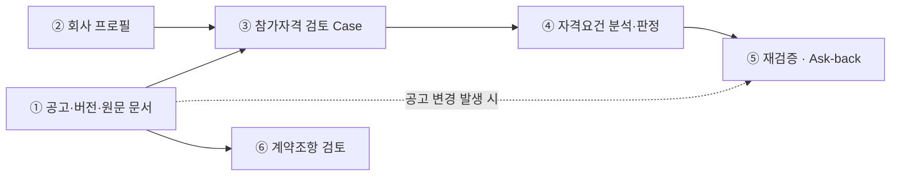

⑦ 인증(로그인 · 세션)은 회사 프로필과 연결되지만 이 검증기 도메인 흐름과는 독립적이라 위 흐름도에는 표시하지 않음 — 아래 도메인별 섹션에서만 다룸.

---

## ① 공고 · 버전 · 원문 문서 (8개 테이블)

### 1-A. 공고 원문 · 버전 · 첨부문서

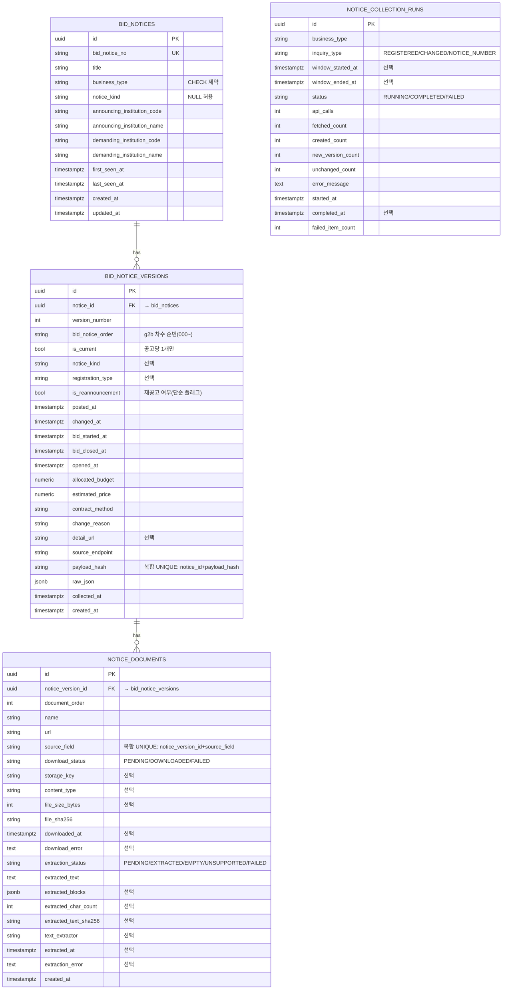

### 1-B. 공고 변경이력 · 연관관계 (재공고 매칭 · 백필 · 사실 추출)

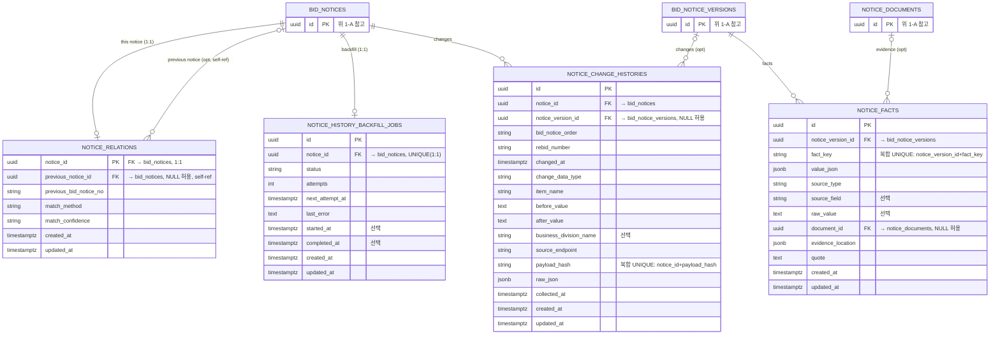

### ① 테이블 참조

| 테이블 | 주요 컬럼 |
|---|---|
| `bid_notices` (PK id) | bid_notice_no (UNIQUE) · title · business_type (CHECK: SERVICE/GOODS/CONSTRUCTION/FOREIGN/OTHER) · notice_kind (선택) · announcing_institution_code/name · demanding_institution_code/name · first_seen_at · last_seen_at · created_at · updated_at |
| `bid_notice_versions` (PK id) | notice_id→bid_notices · version_number · bid_notice_order · is_current · notice_kind(선택) · registration_type(선택) · is_reannouncement · posted_at/changed_at · bid_started_at/bid_closed_at/opened_at · allocated_budget · estimated_price · contract_method · change_reason · detail_url(선택) · source_endpoint · payload_hash · raw_json · collected_at · created_at. 제약: UNIQUE(notice_id, version_number) · UNIQUE(notice_id, bid_notice_order) · UNIQUE(notice_id, payload_hash) · is_current은 공고당 1개만(부분 유니크 인덱스) · is_reannouncement는 단순 bool 플래그이고 실제 원공고 연결은 notice_relations가 담당 |
| `notice_documents` (PK id) | notice_version_id→bid_notice_versions · document_order · name · url · source_field · download_status(PENDING/DOWNLOADED/FAILED) · storage_key(선택) · content_type(선택) · file_size_bytes(선택) · file_sha256 · downloaded_at(선택) · download_error(선택) · extraction_status(PENDING/EXTRACTED/EMPTY/UNSUPPORTED/FAILED) · extracted_text · extracted_blocks(선택) · extracted_char_count(선택) · extracted_text_sha256(선택) · text_extractor(선택) · extracted_at(선택) · extraction_error(선택) · created_at. 제약: UNIQUE(notice_version_id, source_field) |
| `notice_collection_runs` (PK id) | business_type · inquiry_type(REGISTERED/CHANGED/NOTICE_NUMBER) · window_started_at/window_ended_at(선택) · status(RUNNING/COMPLETED/FAILED) · api_calls · fetched/created/new_version/unchanged/failed_item_count · error_message · started_at · completed_at(선택). 다른 테이블을 참조하지 않는 독립 로그 테이블 |
| `notice_change_histories` (PK id) | notice_id→bid_notices · notice_version_id→bid_notice_versions(nullable) · bid_notice_order · rebid_number · changed_at · change_data_type · item_name · before_value/after_value · business_division_name · source_endpoint · payload_hash · raw_json · collected_at · created_at · updated_at. 제약: UNIQUE(notice_id, payload_hash) — g2b 변경이력 원문 저장 |
| `notice_facts` (PK id) | notice_version_id→bid_notice_versions · fact_key · value_json · source_type · source_field · raw_value · document_id→notice_documents(nullable) · evidence_location · quote · created_at · updated_at. 제약: UNIQUE(notice_version_id, fact_key) |
| `notice_history_backfill_jobs` (PK id) | notice_id→bid_notices · status · attempts · next_attempt_at · last_error · started_at/completed_at · created_at · updated_at. 제약: UNIQUE(notice_id) — 공고당 백필 작업 1건(1:1) |
| `notice_relations` (PK notice_id) | notice_id→bid_notices(PK=FK, 1:1) · previous_notice_id→bid_notices(nullable, self-ref) · previous_bid_notice_no · match_method · match_confidence · created_at · updated_at. 재공고 ↔ 원공고 자동 연결 — befBidBbancNo 매칭 결과 |

---

## ② 회사 프로필 (9개 테이블)

### 2-A. 기본 프로필 · 조직 구성

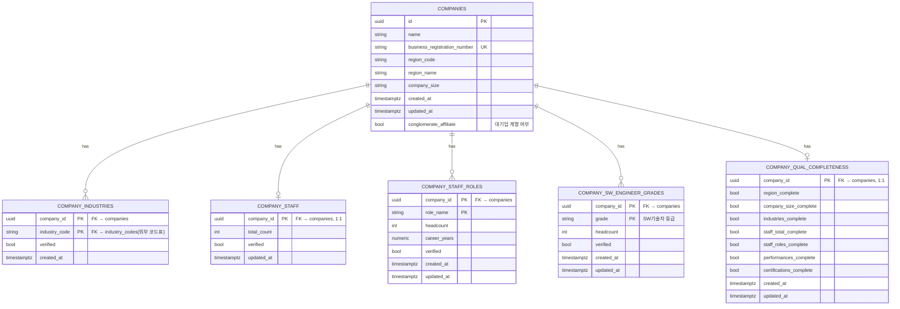

### 2-B. 실적 · 인증 (증빙 이력)

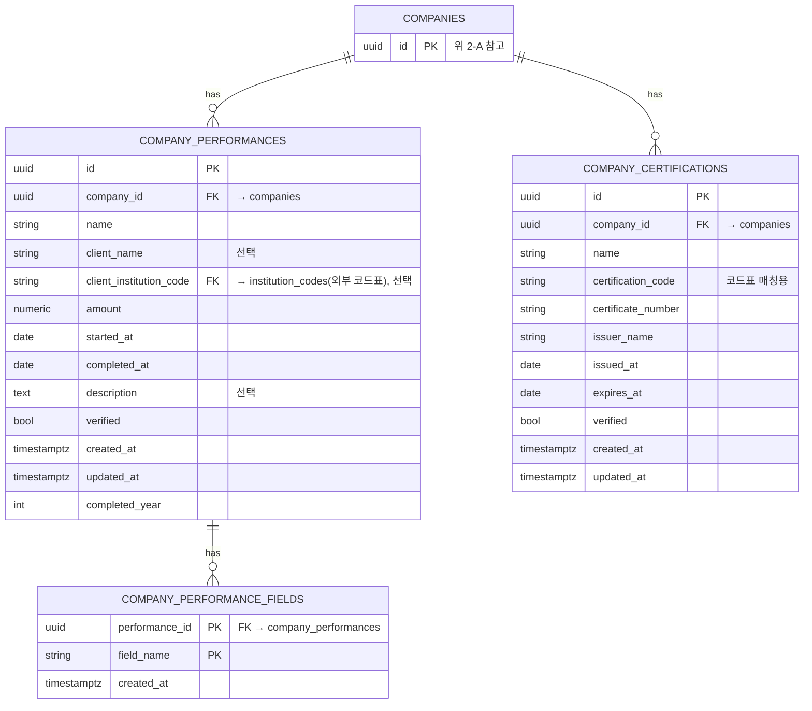

### ② 테이블 참조

| 테이블 | 주요 컬럼 |
|---|---|
| `companies` (PK id) | name · business_registration_number(UNIQUE) · region_code/region_name · company_size · created_at · updated_at · conglomerate_affiliate |
| `company_industries` (PK company_id+industry_code) | company_id→companies · industry_code→industry_codes · verified · created_at |
| `company_staff` (PK company_id) | company_id→companies · total_count · verified · updated_at (1:1) |
| `company_staff_roles` (PK company_id+role_name) | company_id→companies · headcount · career_years · verified · created_at · updated_at |
| `company_sw_engineer_grades` (PK company_id+grade) | company_id→companies · grade · headcount · verified · created_at · updated_at |
| `company_performances` (PK id) | name · client_name(선택) · company_id→companies · client_institution_code→institution_codes(선택) · amount · started_at/completed_at · description(선택) · verified · created_at · updated_at · completed_year |
| `company_performance_fields` (PK performance_id+field_name) | performance_id→company_performances · created_at |
| `company_certifications` (PK id) | name · certification_code · company_id→companies · certificate_number · issuer_name · issued_at/expires_at · verified · created_at · updated_at |
| `company_qualification_profile_completeness` (PK company_id) | company_id→companies · region/company_size/industries/staff_total/staff_roles/performances/certifications_complete (1:1) · created_at · updated_at |

---

## ③ 참가자격 검토 Case (2개 테이블)

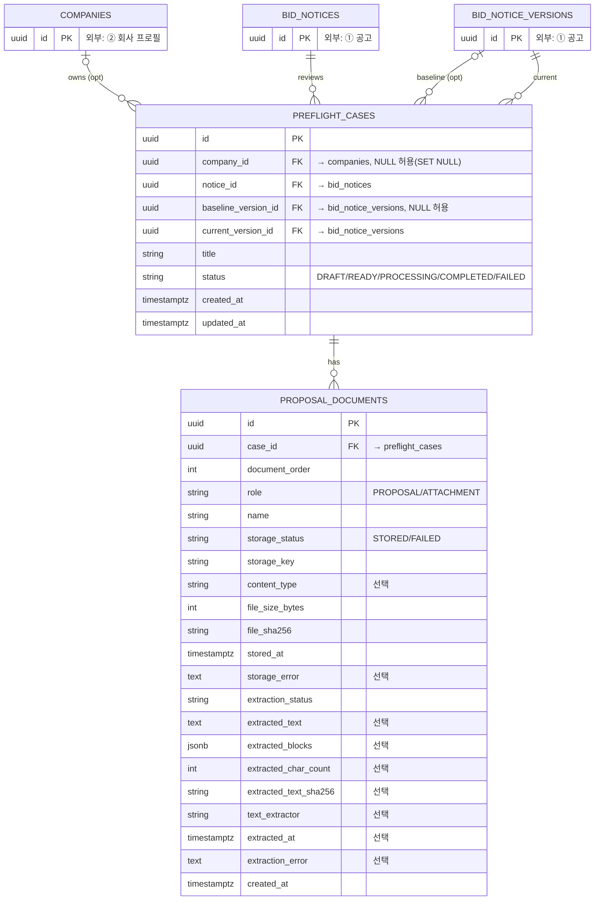

### ③ 테이블 참조

| 테이블 | 주요 컬럼 |
|---|---|
| `preflight_cases` (PK id) | company_id→companies(nullable, SET NULL) · notice_id→bid_notices · baseline_version_id→bid_notice_versions(nullable) · current_version_id→bid_notice_versions · title · status(DRAFT/READY/PROCESSING/COMPLETED/FAILED) · created_at · updated_at. 주의: baseline_version_id가 NULL이거나 current_version_id와 같으면 변경 비교가 성립하지 않음(J13~J16 시드에서 실제로 겪은 문제) |
| `proposal_documents` (PK id) | case_id→preflight_cases · document_order · role(PROPOSAL/ATTACHMENT) · name · storage_status(STORED/FAILED) · storage_key · content_type(선택) · file_size_bytes · file_sha256 · stored_at · storage_error(선택) · extraction_status · extracted_text(선택) · extracted_blocks(선택) · extracted_char_count(선택) · extracted_text_sha256(선택) · text_extractor(선택) · extracted_at(선택) · extraction_error(선택) · created_at. 제약: UNIQUE(case_id, file_sha256) · UNIQUE(case_id, document_order) |

---

## ④ 자격요건 분석 · 판정 (5개 테이블)

### 4-A. 자격요건 분석 (LLM 추출)

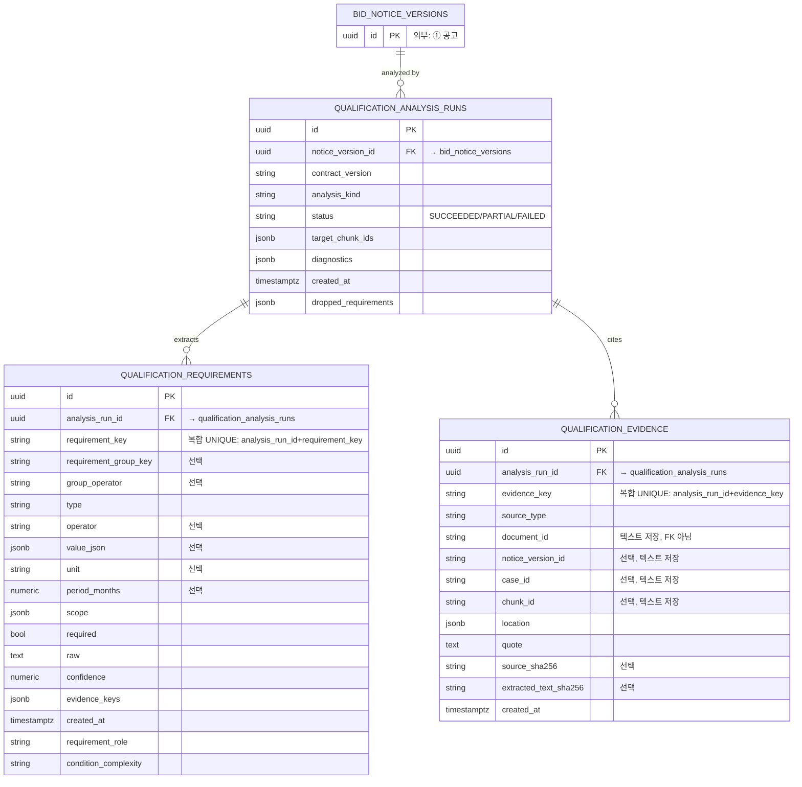

### 4-B. 참가자격 판정 (룰 기반)

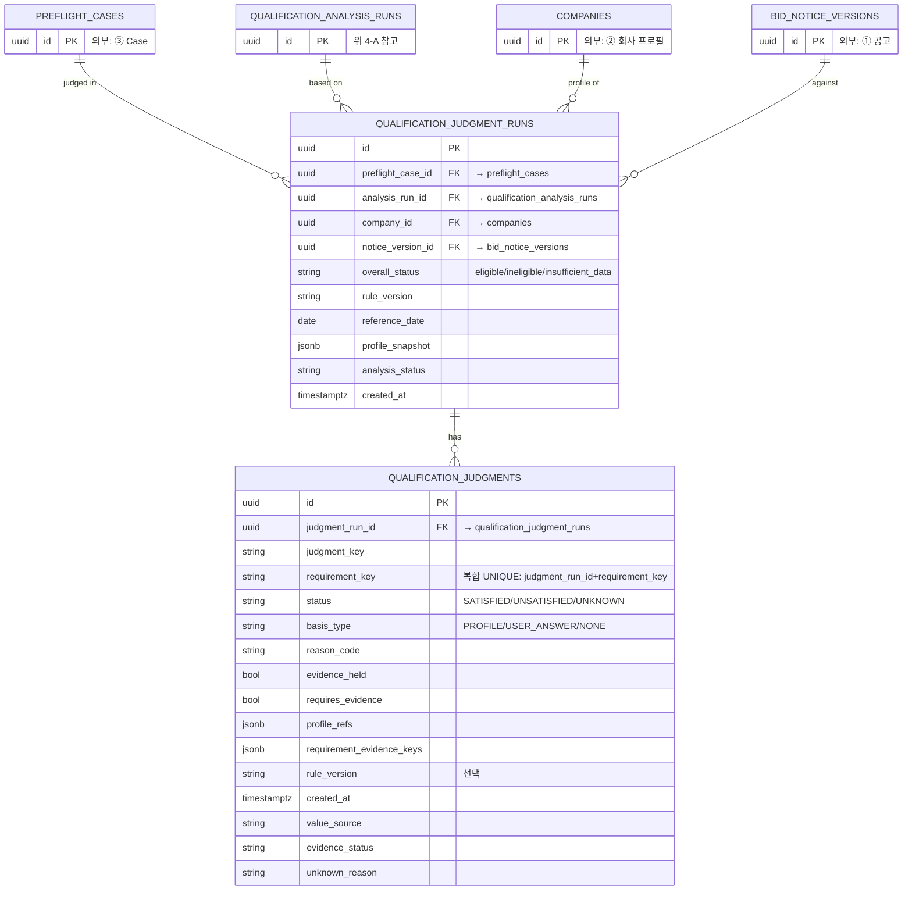

### ④ 테이블 참조

| 테이블 | 주요 컬럼 |
|---|---|
| `qualification_analysis_runs` (PK id) | notice_version_id→bid_notice_versions · contract_version · analysis_kind · status(SUCCEEDED/PARTIAL/FAILED) · target_chunk_ids · diagnostics · created_at · dropped_requirements. 같은 버전에 여러 run 가능 — 추출 비결정성으로 run마다 결과가 달라질 수 있음(현재 확인 중, 재현님 PR#135로 상당부분 개선됨) |
| `qualification_requirements` (PK id) | analysis_run_id→qualification_analysis_runs · requirement_key · requirement_group_key(선택) · group_operator(선택) · type · operator(선택) · value_json(선택) · unit(선택) · period_months(선택) · scope · required · raw · confidence · evidence_keys · created_at · requirement_role · condition_complexity. 제약: UNIQUE(analysis_run_id, requirement_key) |
| `qualification_evidence` (PK id) | analysis_run_id→qualification_analysis_runs · evidence_key · source_type · document_id(텍스트, FK 아님) · notice_version_id(선택) · case_id(선택) · chunk_id(선택) · location · quote · source_sha256(선택) · extracted_text_sha256(선택) · created_at. 제약: UNIQUE(analysis_run_id, evidence_key) |
| `qualification_judgment_runs` (PK id) | preflight_case_id→preflight_cases · analysis_run_id→qualification_analysis_runs · company_id→companies · notice_version_id→bid_notice_versions · overall_status(eligible/ineligible/insufficient_data) · rule_version · reference_date · profile_snapshot · analysis_status · created_at |
| `qualification_judgments` (PK id) | judgment_run_id→qualification_judgment_runs · judgment_key · requirement_key · status(SATISFIED/UNSATISFIED/UNKNOWN) · basis_type(PROFILE/USER_ANSWER/NONE — 문서근거·귀사답변 구분) · reason_code(RULE_MATCH/RULE_MISMATCH/INSUFFICIENT_DATA/NEEDS_REVIEW/UNSUPPORTED_REQUIREMENT) · evidence_held · requires_evidence · profile_refs · requirement_evidence_keys · rule_version(선택) · created_at · value_source · evidence_status · unknown_reason. 제약: UNIQUE(judgment_run_id, requirement_key) |

---

## ⑤ 재검증 · Ask-back (2개 테이블)

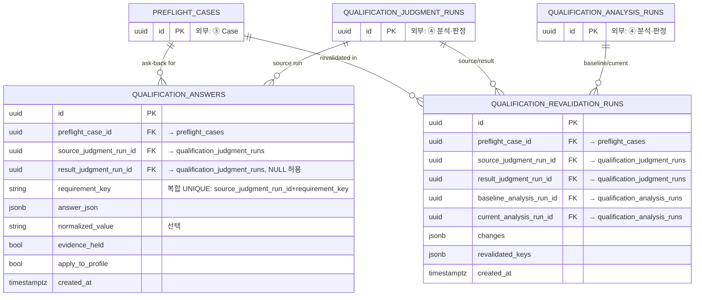

### ⑤ 테이블 참조

| 테이블 | 주요 컬럼 |
|---|---|
| `qualification_answers` (PK id) | preflight_case_id→preflight_cases · source_judgment_run_id→qualification_judgment_runs · result_judgment_run_id→qualification_judgment_runs(nullable) · requirement_key · answer_json · normalized_value(선택) · evidence_held · apply_to_profile · created_at. 제약: UNIQUE(source_judgment_run_id, requirement_key) |
| `qualification_revalidation_runs` (PK id) | preflight_case_id→preflight_cases · source/result_judgment_run_id→qualification_judgment_runs · baseline/current_analysis_run_id→qualification_analysis_runs · changes · revalidated_keys · created_at |

---

## ⑥ 계약조항 검토 (2개 테이블 · 신규 편입)

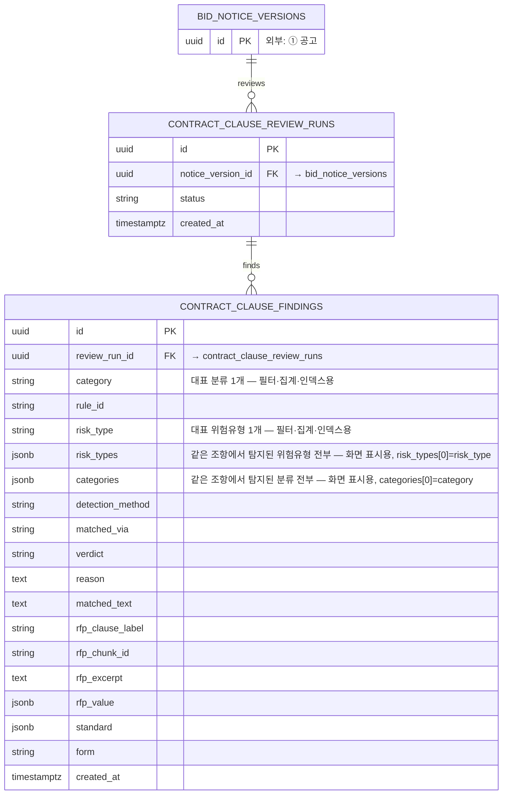

### ⑥ 테이블 참조

| 테이블 | 주요 컬럼 |
|---|---|
| `contract_clause_review_runs` (PK id) | notice_version_id→bid_notice_versions · status · created_at |
| `contract_clause_findings` (PK id) | review_run_id→contract_clause_review_runs · category · rule_id · risk_type · risk_types · categories · detection_method · matched_via · verdict · reason · matched_text · rfp_clause_label/rfp_chunk_id/rfp_excerpt/rfp_value · standard · form · created_at. category/risk_type(단일)과 categories/risk_types(배열, jsonb)는 컬럼 전환 중이 아니라 용도가 다름(재현님 확인, 9/15) — 단수는 대표 분류 1개로 필터·집계·인덱스용, 복수는 같은 조항에서 함께 탐지된 분류 전부로 화면 표시용. categories[0]=category, risk_types[0]=risk_type이 코드로 강제됨. 화면 표시는 복수, 검색·통계는 단수 사용 |

---

## ⑦ 인증 (2개 테이블 · 이 ERD 핵심 범위 밖, 참고용)

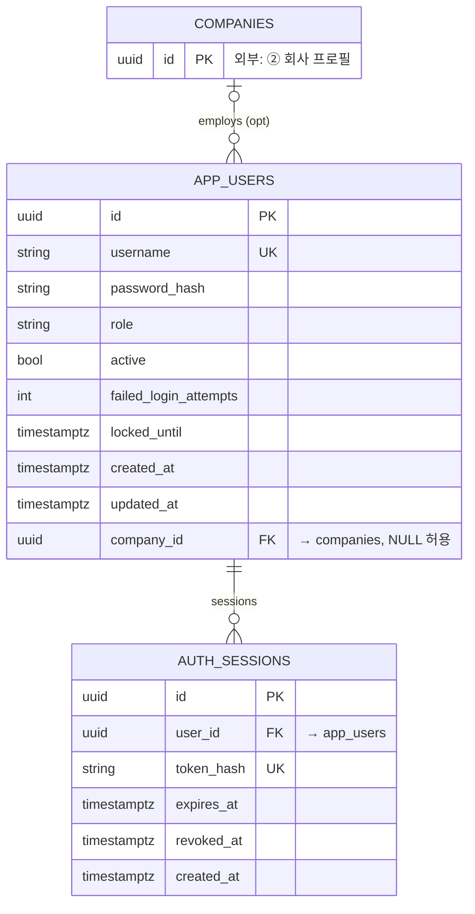

### ⑦ 테이블 참조

| 테이블 | 주요 컬럼 |
|---|---|
| `app_users` (PK id) | username(UNIQUE) · password_hash · role · active · failed_login_attempts · locked_until · created_at · updated_at · company_id→companies(nullable) |
| `auth_sessions` (PK id) | user_id→app_users · token_hash(UNIQUE) · expires_at · revoked_at · created_at |

---

## 다루지 않는 테이블

public 스키마 전체 34개 테이블 중 아래 4개는 도메인 다이어그램에 박스로 그리지 않았습니다. 존재는 라이브 DB(information_schema)로 확인했고, 코드표·인프라 성격이라 FK 코멘트로만 참조합니다.

- `industry_codes` · `institution_codes` — 업종/기관 코드표. company_industries.industry_code, company_performances.client_institution_code 등에서 참조.
- `product_codes` — 품목 코드표. 이번 ERD의 21+9개 테이블 어디에서도 직접 FK로 참조하지는 않아 연결 지점은 별도 확인 필요.
- `alembic_version` — 마이그레이션 버전 관리용 시스템 테이블, 도메인 데이터 아님.
