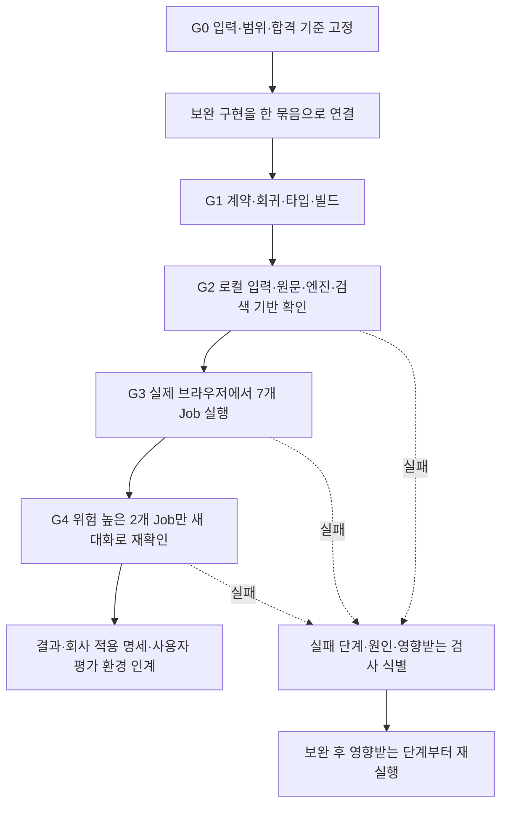

# 사용자 평가 진입을 위한 통합 파이프라인 설계

2026-09-16. 현재 코드 `6af3b4f`, 작업 브랜치 `codex/ai-copilot-evaluation-ready`.

설계 문서다. 실행기·새 테스트·제품 변경을 구현하거나 DB/모델 검사를 실행하지 않았다. 41번 통합 설계와 Q-017/018/019를 한 실행 흐름으로 묶는다. 목표는 정의한 위험을 빠짐없이 확인하면서 동일 모델 요청·중복 검사를 줄이는 것이다. 모든 자유 질문의 무오류를 보장하는 검증 계획은 아니다.

## 1. 전체 작업에서의 위치

① 감사 → ② 연결 확인 → ③ 기본 검사 이력 유지 → **④ 통합 보완/검증: 이 파이프라인** → ⑤ 사용자 평가 → ⑥ 최신 develop 대비 최종 통합 판단.

공용 DB 적용·merge·배포는 이 파이프라인의 실행 대상이 아니다. 검증된 회사 입력의 향후 적용 자료까지 만든다. 현재 사용자 테스트 사례와 새 검증 사례를 분리한다.

## 2. 한 실행 흐름

한 파이프라인은 한 번 실행하면 무조건 성공한다는 뜻이 아니다. 독립 검사는 계속 수집하고, 실패에 의존하는 고비용 단계는 실행하지 않는다. 동일 입력 재시도를 합격할 때까지 반복하지 않는다.

## 3. G0 — 입력과 합격 기준 고정

### 실행 전 생성할 manifest

- 실행 ID, HEAD, 수정 파일 내용 hash, 의존성/프롬프트/판정 규칙 버전. 미commit 코드도 hash로 구별한다.
- 공고번호·차수·원본/추출 hash·분석 ID·인덱스 generation/임베딩 모델·청킹 버전.
- 회사별 canonical 입력, 공고별 추가 답변, 기준일 및 시나리오 시각, 실제 DB 매핑.
- DB 소유 표식·컨테이너 ID·DB명, 서버 코드 기준·PID·접속 주소·설정 상태. 동적 포트는 매 실행 확인한다.
- Job별 필수 산출물, 근거 위치와 기대 사실, 금지되는 결론, 허용되는 보류 사유.
- 실행 가능한 쓰기 작업의 정확한 로컬 사례 범위, 모델/원문 전송 범위, 예약 예산 상한.

범위/입력 문서는 회사 사실과 원문 해석을 구분한다. expected 판정은 평가 기준 파일에 두고 모델 입력과 제품 판정값으로 직접 주입하지 않는다. 기존 사용자 J13은 읽기/보존 대상으로 남긴다.

### Q-019 선행 결정

1. v03 네 조건 묶음의 충족과 실제 종합 참가 판정을 별도 결과로 검사한다. 전체 참가 가능 데모를 요구하면 그 밖의 필수 조건도 검수된 입력 명세가 필요하다. 불일치 상태를 감춰 통과시키지 않는다.
2. 특정 차수의 검수된 업종군·운반 예외 해석을 원문/규칙 metadata로 관리한다. 회사 프로필에 해석 승인 플래그를 넣지 않는다. Q-009 공식 자료 불일치와 v03의 데모 기준을 구분해 기록한다.
3. 방문 확인서=예, 장비·법적 허가 복합 예/아니오/미확인의 필드 매핑과 시간 기준을 고정한다.

미결정이면 해당 기대 판정 검사는 BLOCKED이며 정답을 생성하지 않는다. Job/검색 계약 구현과 모델 없는 검사는 독립적으로 진행할 수 있다. 결정 요청은 세 항목을 한 번에 묶어 구체적 명세와 함께 전달한다.

## 4. 보완 구현 — 구성요소를 연결하고 나서 통합 검증

구현 묶음은 다음 순서로 연결한다.

1. 최초 Job의 산출물·현재 질문·미해결 이유·실행 상태 계약.
2. 남원 네 입력의 안전한 별도 적재/조회 매핑과 차수별 판정 연결.
3. LangChain Retriever/예시 포함 prompt/모델 연결, 준비된 인덱스와 범위 보완.
4. 근거를 가진 제출 의무와 준비 선후 관계, 검증한 항목 재사용/기준 변경 시 무효화.
5. 질문에 직접 답하는 화면·접힌 근거·짧은 상태, 가정/제안/명시 실행/갱신 연결.

변경하는 계약의 실패를 잡는 작은 검사는 구현 중 실행한다. 매 파일 수정마다 전체 회귀나 실제 모델을 돌리지 않는다. 현재 코드에서 확인된 실패를 재현하는 회귀만 추가·수정하고, 구현을 그대로 복사하는 검사로 수를 늘리지 않는다.

## 5. G1 — 외부 모델 없는 최종 후보 검사

검증 단위는 테스트 함수 개수가 아니라 아래 위험의 포함 여부다. 기존 회귀를 재사용하고 누락된 실패 재현만 보완한다.

| 검사 책임 | 최소 필수 확인 |
| --- | --- |
| Job 완료 | 최초 GOAL 누락→후속 단일 도구 PASS여도 최초 미완료 유지, 모순 거절→관련 미해결 이유 존재 |
| 요청 의미 | 설명 완료와 회사의 외부 확인/실제 실행 구분, 새 요청을 과거 목적에 강제로 덮어쓰지 않음 |
| 업무 관계 | 서로 다른 서류/제출 단계 분리, 필드별 근거 유지, 제출 후 자료 준비와 같은 선후 충돌 감지 |
| 데이터 경계 | 회사·Case·차수·분석·규칙/프로필·문서 fingerprint 변경 시 해당 결과 재검토 |
| 실패 대응 | 판정 없음/자료 없음/오래된 인덱스/모델 오류/근거 속 악의적 지시에서 거짓 완료 금지 |
| 쓰기 경계 | 가정·자연어 동의로 저장하지 않음, 다른 회사·오래된 제안·중복 실행 거절 또는 기존 결과 재사용 |
| 화면 계약 | 검토 목적/미검증 원문 기본 접힘, 내부 ID/빈 인용/원시 JSON이 기본 답변에 노출되지 않음 |
| 설치·빌드 | 실제 의존성 설치/호환, 타입 검사, production build 및 기존 필수 CI 확인 |

`verify_copilot_v31.py`와 프론트의 기존 검사들을 최종 후보에서 한 번 수행한다. 여기서 PASS는 모델 생성 품질을 뜻하지 않는다. 이후 변경이 생기면 의존성 규칙에 따라 관련 검사만 재실행하며, 공통 상태/출처/인증 코드를 바꾸면 넓게 재검사한다.

## 6. G2 — 전용 로컬 DB와 검색 기반 확인

### 원문과 판정 기반

- 소유 확인한 전용 로컬 PostgreSQL을 사용한다. 다른 DB로 자동 대체하지 않는다.
- 기존 사용자 사례의 보존 기준을 기록한다. 새 run 식별자의 네 회사/사례를 생성하고 입력 readback을 canonical 입력과 비교한다. 원본 초기화/덮어쓰기를 하지 않는다.
- 남원 000/001 원문·추출·요건 연결을 검사한다. 기존 추출 결과를 재생하는 검사와 변경된 추출기가 원문부터 산출한 결과를 구별한다. 추출기가 바뀌었다면 각 차수에 대해 실제 추출을 한 번 수행하고 이후 네 회사가 그 결과를 공유한다.
- 네 회사×두 차수의 판정을 제품 엔진으로 한 번씩 실행한다. 총 8개 판정 산출물의 상태·이유·예외·종합 집계·동일 회사 snapshot/규칙/기준일을 비교한다.
- J16의 확인 필요 이유가 회사의 운반 예외 정보 부족인지 확인한다. 단순 UNKNOWN 일치로 통과시키지 않는다.
- 표기 변경과 구조화 값 변경을 구분한다. 요건 ID가 달라졌다는 이유로 내용 변경/삭제를 만들어서는 안 된다.
- 다른 Core 세 공고의 원문/분석/회사/판정 자료도 뒤의 대표 Job이 읽을 수 있는지 사전 확인한다. 없는 판단을 임의로 만들거나 전체 미달을 정상 입력으로 간주하지 않는다.

### RAG 기반

- 선택한 버전을 한 번 사전 준비하고 READY·manifest·원문 위치를 확인한다.
- 버전 필터와 예외 조항 회수가 되는지 고정 질의로 검사한다. 생성 LLM 없이 가능하되 실제 임베딩/질의 임베딩 비용은 같은 예산에 포함한다.
- 같은 문서에 대한 재질문에서 **문서 임베딩** 0회 확인. 새 질문의 질의 임베딩은 구별한다.
- 런타임 재시작 후 인덱스 재사용을 확인하고 이후 같은 서버에서 G3/G4를 진행한다. 이는 대화 재시작 복원 기능 통과를 뜻하지 않는다.
- 오래된 원문/인덱스 차단은 복제된 테스트 입력에서 검사한다. 사용자가 쓰는 원본을 변조하지 않는다.

G2의 성공한 입력·분석·인덱스를 G3에서 그대로 사용한다. 각 대화마다 다시 추출·임베딩·판정하지 않는다. 명시적 답변 반영 시 필요한 재판정은 별도 실행 사건으로 기록한다.

## 7. G3 — 실제 브라우저 7개 Job으로 여러 계층을 함께 검증

모든 Job은 실제 로그인→현재 제품 API→전용 DB/실제 검색/모델→화면 경로를 사용한다. 같은 질문을 API 검사와 브라우저 검사에서 두 번 모델 호출하지 않는다. 브라우저 실행 중 네트워크 응답과 서버 trace, 판정 전후를 함께 수집한다.

아래 7개는 업무 차이로 나눈 초기 최소 묶음이다. 각 Job은 3~4턴 정도로 구성하되 개수보다 필수 행동의 포함 여부를 우선한다.

| Job | 데이터/목적 | 한 대화에 넣을 확인 |
| --- | --- | --- |
| N1 | 남원 J13 변경 대응 | 변경/유지 구분→회사 영향→근거 지시어→할 일; 잘못된 반전 방향 질문에도 저장 결과 유지 |
| N2 | 남원 J14 반대 방향 | 같은 변경에 반대 영향→직접 원인→남은 행동; J13 결론 재사용 금지 |
| N3 | 남원 J15 예외 | 등록 없는데 충족하는 이유→장비만 있어도 되는지→근거/행동; 법적 허가 조건 보존 |
| N4 | 남원 J16 확인/반영 | 미확인 이유→비저장 가정→구체적인 답변 제안→명시 버튼 실행/갱신; 취소/중복/오래된 제안 분기는 G1/로컬 API에서 검증 |
| C1 | 구내식당 J05 참여 준비 | 조건/서류/기한/방법/순서 복합 질문→남은 것만→실행 체크리스트; 14시/15시, 필수/협조, 선정 후/계약 시 구분 |
| C2 | 우치공원 변경 대응 | 요건 삭제→회사 영향→현재 필요한 행동; 삭제를 충족으로 바꾸지 않음 |
| C3 | 한림대 변경 해석 | metadata 변경→실제 요건/영향→근거 후속; 표시 변화만으로 판정 반전 주장 금지 |

시나리오 간 회사/차수 전환을 함께 확인한다. 각각 별도 사용자/회사 범위와 대화로 시작하고, 동일 대화의 후속은 끝날 때까지 순서대로 실행한다. 전체 지연을 비교할 때 Job들을 병렬 모델 호출하지 않는다. 별도 생성 부하로 속도 측정을 왜곡하지 않기 위함이다.

N4는 원래 Golden 기대값을 기록한 뒤 **동일 입력의 별도 실행용 사례**에서 추가 답변을 반영한다. 고정 Golden 입력과 사용자 평가에 보여줄 초기 상태를 소비하지 않는다. 모델이 잘못된 제안을 만들면 자동화가 올바른 payload로 바꿔 실행하지 않고 실패로 기록한다.

### 성공 여부는 제품의 자체 PASS와 독립적으로 판단

각 Job의 기대 사실·금지 결론·필수 산출물·필요한 원문 위치를 G0에 고정한다. 내부 `task_status=PASS` 또는 HTTP 200만으로 합격시키지 않는다.

- 결정적 확인: 상태/수치/날짜/버전·출처 존재, 문서 임베딩 횟수, LangChain 실제 호출, 쓰기/재판정 기록.
- 근거 대조: 필수 조건/예외/서류/기한의 의미와 최초 요청 누락 여부를 고정된 원문 기준으로 검토한다. 문장 완전 일치 검사는 쓰지 않는다.
- 직접 출력 검토: 최종 답변과 핵심 화면을 읽어 잘못된 연결·의미 반복·모호한 다음 행동을 확인한다. 이 검토는 정해진 Job 산출물 전체에 대해 수행하며 LLM의 자기평가로 대체하지 않는다. 별도 평가 모델을 모든 턴에 추가하지 않는다.
- UI 캡처는 각 Job의 최종 요약/핵심 원문 위치, N4의 제안/실행 후 결과처럼 증거가 필요한 지점에 한정한다. 로그인·각 대기 화면의 반복 캡처는 생략한다.

남원 일부 조건 검사와 전체 종합 판정이 다르면 두 결과를 함께 기록한다. Golden 범위만 통과했을 때 이를 전체 참가 가능 데모 합격으로 발표하지 않는다.

## 8. G4 — 최소 반복과 사용자 평가 인계

최초 G3 통과 후 변동 위험이 큰 두 Job만 새 대화/복제된 동일 초기 입력으로 한 번 더 실행한다.

- C1: 긴 복합 요청, 원래 Job 유지, 여러 제출 시점과 준비 순서.
- N4: 미확인, 가정과 사실, 명시 실행과 새 판정 조회.

총 최초 7개 Job + 위험 높은 2개 Job 재확인이 기본 설계다. 반복 2회로 통계적 안정성이나 p95를 입증한다고 하지 않는다. 실패하면 바꾸지 않은 조건으로 반복해 우연한 PASS를 고르지 않고 원인을 분류한다. 추가 반복은 수정 영향이나 관찰된 변동성에 근거해서만 실행한다.

최종 코드/환경이 G1~G4 근거와 일치하고 필수 미실행/실패가 없을 때 `READY_FOR_USER_EVALUATION`로 표시한다. `PRODUCT_COMPLETE`와 구별한다. 사용자 평가용 네 초기 사례와 로그인·목표 안내를 준비하고, 고정 Golden 상태를 유지한다.

## 9. 검사 중복을 없애는 규칙

| 없앨 중복 | 유지할 검증 |
| --- | --- |
| 매 답변을 API와 화면에서 각각 다시 모델 호출 | 하나의 실제 화면 실행에서 API/DB/모델/화면 trace 수집 |
| 동일 원문을 네 회사마다 추출/임베딩 | 차수별 준비 결과 공유, 회사별 실제 판정만 별도 |
| 매 코드 편집 후 전체 회귀 | 관련 실패 검사→최종 후보 전체 필수 회귀 1회 |
| 모든 오류 분기를 실제 모델로 재현 | 상태/권한/timeout/stale 분기는 가짜 모델·로컬 API로 결정적으로 검사 |
| 같은 문장을 여러 말투로만 늘려 점수 계산 | 서로 다른 실패 유형을 담은 업무 시나리오 |
| 매 턴 별도 평가 모델 호출 | 제품 검증 + 고정 외부 기준 + 최종 출력/원문 직접 대조 |
| 이전 실행의 PASS를 최신 코드에 그대로 합산 | 코드/데이터/프롬프트/인덱스 의존성이 같은 근거만 재사용 |

개발 회귀의 익숙한 문장과 자유 표현을 구분한다. G3 일부 후속은 사전에 프롬프트 예시로 쓰지 않은 표현으로 두되 새로운 사실·정답을 테스트 중 임의로 추가하지 않는다.

## 10. 실패 시 재실행 범위

| 변경/실패 원인 | 무효화하고 다시 확인할 범위 |
| --- | --- |
| 한 회사 입력/답변 매핑 | 해당 회사 readback·양쪽 판정·해당 Job; 매핑 공통 코드면 네 회사 전체 |
| 판정 규칙/원문 해석 | 영향 차수의 모든 회사 판정과 관련 설명 Job |
| 추출/청킹/임베딩 | 해당 문서 산출물·검색·관련 Job; 요건이 바뀌면 엔진 판정까지 |
| LangChain 공통 경로/생성·검증 prompt | 관련 계약 검사 + 이 경로를 사용하는 전체 Job |
| Job 상태·근거/권한 공통 코드 | 공통 회귀 + 7개 Job 전체; 결과 재사용 범위를 좁게 추정하지 않음 |
| 화면 접힘/배치만 변경 | 기존 응답을 로컬 재생해 화면/빌드 검사; 서버 요청이나 상태 연결도 바뀌면 실제 해당 Job |
| 제공자 일시 오류 | 실패 기록을 남기고 원인 확인 후 해당 Job만 제한 재시도; 실패 비용 포함 |
| 문서 오탈자만 변경 | 해당 문서 확인. 제품 검사 재실행 불필요 |

각 재사용 결과에 어느 실행의 어떤 코드·데이터 근거인지 표시한다. 숨은 fixture 수정, 기대값 하향, 실패 로그 덮어쓰기, 실패 검사 제거로 통과시키지 않는다.

## 11. 품질·시간·비용의 판정

세 축을 별도 저장한다: 사실/Job 정확성, 사용자 읽기 품질, 지연/비용. 한 축의 성공으로 다른 실패를 상쇄하지 않는다.

- 자격·예외·제출기한의 잘못된 핵심 주장, 다른 회사/차수 혼입, 확인 없는 저장, 거짓 완료: 사용자 평가 진입 차단.
- 자료 부족이 있는 경우: 사전 정의된 정상 보류인지 구현 실패인지 구별. 이유/행동이 충분하면 설명 요청은 완료할 수 있지만 참가 판정/실행을 완료로 바꾸지 않는다.
- 부수적인 표현·레이아웃 문제: 실제 과업 방해 여부를 기록하고 진입 판단에 반영. 테스트 수를 맞추기 위한 새 항목은 만들지 않는다.
- 지연 기준 제안: 기본/짧은 후속은 20초, 넓은 복합/비교는 45초를 완료 응답의 초기 상한으로 검토한다. 이는 이번 운영 제안이며 기존의 기본 응답 p50 8초/p95 20초 목표를 실측 달성했다는 뜻이 아니다. 넘으면 정확성 결과와 별도로 `LATENCY_NOT_MET`이며 전체 품질 합격으로 묶지 않는다.
- 첫 표시 시간과 검증된 최종 답변 시간을 구분한다. 스트리밍으로 미검증 초안을 먼저 보였다고 최종 답변 지연 통과로 계산하지 않는다.
- 모델 계획/검색/질의 임베딩/생성/검증/전체 시간을 같은 실행에서 수집한다. API 응답 시간이 제공자의 대기/추론/전송 각각을 측정한 것은 아니다.
- 기존 승인 예산과 누적 예약 장부를 유지한다. 실행 전 각 Job의 최대 호출/입출력 토큰과 인덱싱 상한으로 전체 실행의 보수적 예약치를 계산한다. 잔액 부족이면 의존 모델 단계 전에 보고한다. 테스트 시작마다 누적 비용을 0으로 초기화하지 않는다. 새 예산 승인을 이미 승인된 범위 안에서 반복 요청하지 않는다.

## 12. 기존 실행기 재사용과 필요한 신규 부분

재사용 후보는 확인한 현재 파일을 기준으로 한다.

- `scripts/verify_copilot_v31.py`: DB/네트워크 차단 회귀와 source hash/trace 기록.
- `scripts/test_copilot_db.py`: 소유 확인한 로컬 PostgreSQL, DB 회귀, 실제 모델 opt-in/예산 경계.
- `scripts/local_copilot_evaluation.py`: 지속 로컬 환경과 예산 장부. 기존 v02 초기 적재는 새 v03 적재로 대체 실행하지 않고 별도 adapter를 추가해야 함.
- `scripts/check_local_namwon_chat.mjs`: 실제 로그인/채팅/판정 불변/화면 기록 패턴. 고정 두 질문·읽기 전용 제약은 전체 Job 및 정확한 로컬 쓰기 범위로 보완 필요.
- `scripts/verify_copilot_core_changes.py`, `test_copilot_core_jobs_db.py`: Core 입력/실행 근거 참고. 내부 PASS와 도구 사용 확인만으로 새 외부 합격 기준을 대체하지 않음.

새로 필요한 것은 실행 순서·manifest·Job별 기대 기준·근거 수집·재개/무효화를 묶는 얇은 실행기다. 기존 판정/검색/대화 구현을 테스트 실행기 안에 복제하지 않는다. LangChain 사용도 평가기 전용 우회 경로가 아닌 실제 v3.1 제품 경로에서 확인한다.

예정 실행 인터페이스는 `plan`(무실행·의존성/예산/차단 확인), `run`(고정 manifest 실행), `resume`(같은 manifest·변경 영향 확인 후 재개)로 나눈다. 현재 이런 통합 명령이 구현되어 있다고 보고하지 않는다. 실패마다 새 스크립트를 만들어 분기하지 않는다.

## 13. 산출물과 알림

한 실행 폴더 안에 manifest, 입력 readback/판정 비교, 회귀 결과, Job별 요청/응답/근거/시간/비용, 필요한 화면 캡처, 실패 목록을 모은다. 최종 보고는 각 Job의 정확성/완료/화면/시간 및 미실행 항목을 한 표로 보여준다.

네 회사 적용 명세에는 프로필과 공고별 답변, 예/아니오/미확인, 차수/검수 기준, 로컬 필드 매핑, 실제 판정과 사유, 공용 DB 적용 전후 비교 절차를 담는다. 로그인 비밀번호·키·비공개 원문 사본을 Git 산출물에 넣지 않는다.

진행 표시는 `④ G0 기준 고정 → 구현 → G1 저비용 검사 → G2 로컬 기반 → G3 Job → G4 재확인 → ⑤ 사용자 평가`로 통일한다. 사용자에게 매 질문 테스트를 넘기지 않는다.

중간 질문/알림은 (1) Q-019처럼 기대값을 바꾸는 결정 (2) 공통 결함으로 다음 단계가 막힘 (3) 승인 예산 부족 (4) 사용자 평가 준비 완료에 집중한다. 자동 승인 검토가 거절하면 명령 실행 여부와 실제 거절 이유를 별도로 보고하며 제품 검사 실패로 기록하지 않는다.
